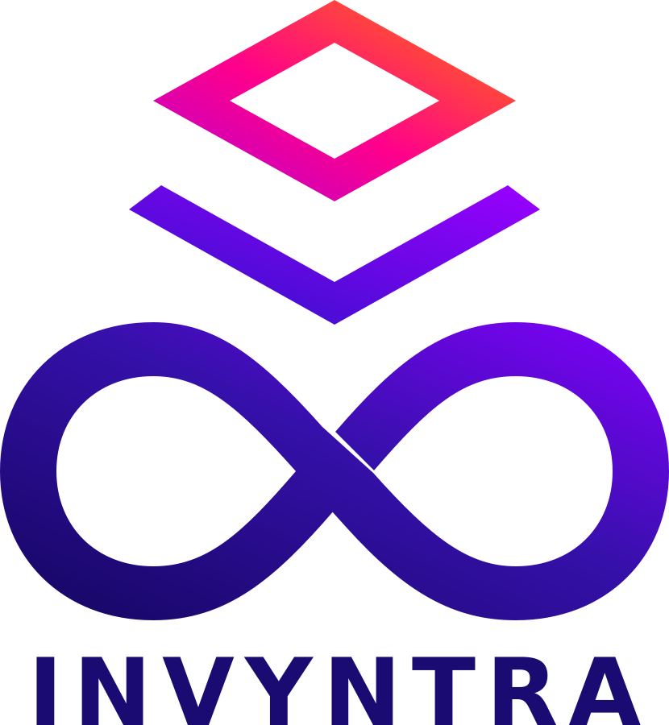
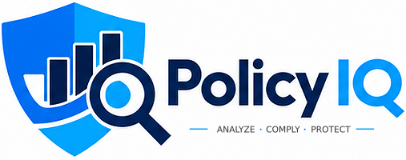
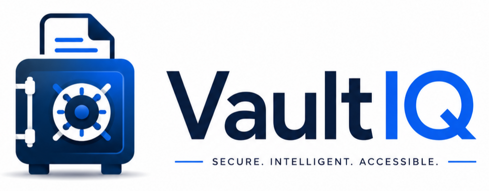
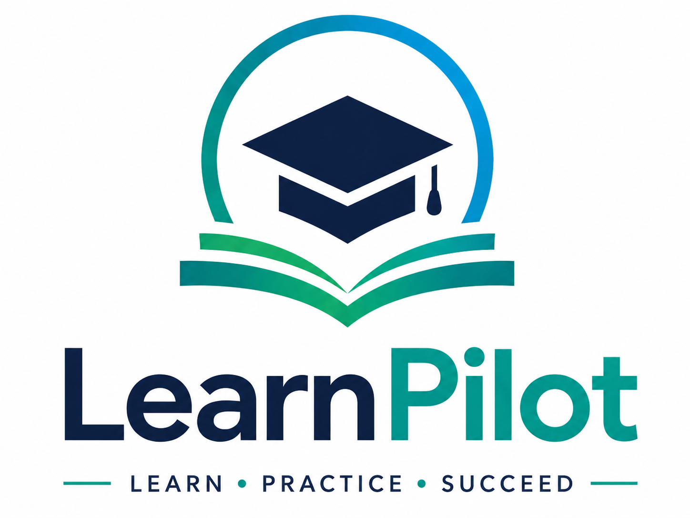
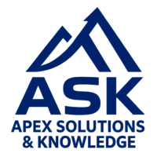

 
I design, build, and stabilize backend systems, APIs, and integrations that support real-world business operations — especially when systems are messy, unreliable, or not scaling.  
My work focuses on stabilizing applications, connecting systems correctly, and improving how data flows between platforms, including CRM and lifecycle marketing systems where they impact revenue and performance. 
 
I work across PHP, WordPress, Node.js, TypeScript, Python (FastAPI), React, and SQL-based systems to deliver reliable, production-ready solutions.

---

# Featured Platforms

## Invyntra

A multi-tenant asset lifecycle and compliance platform designed to help organizations track, manage, and stay ahead of critical asset expiries, inspections, maintenance activities, and operational workflows.

### Highlights

- Multi-tenant architecture
- Role-based access control
- Asset lifecycle management
- Inspection and maintenance workflows
- Escalations and notifications
- Reporting and operational visibility
- REST APIs and workflow automation

**Tech:** Node.js, Express, TypeScript, Prisma, PostgreSQL, React

**Repo:** https://github.com/jack-ivanisevic/Invyntra

---

## PolicyIQ

An AI-assisted policy governance platform focused on helping organizations manage policies, versions, approvals, and compliance processes.

### Highlights

- Policy lifecycle management
- Version control and audit history
- Role-based access control
- Organization-aware architecture
- AI-assisted policy understanding
- Mobile-first experience
- Secure and scalable design

**Tech:** React Native, Expo, TypeScript, PostgreSQL, REST APIs

**Repo:** https://github.com/jack-ivanisevic/PolicyIQ

---

## VaultIQ — AI-Powered Document Intelligence

**Secure. Intelligent. Accessible.**

VaultIQ is a planned AI-powered document intelligence and secure management platform developed by Apex Solutions & Knowledge (ASK).

Designed initially for businesses, VaultIQ aims to simplify how organizations securely store, organize, search, and manage important documents throughout their lifecycle. A personal edition is envisioned for future development.

### Planned Capabilities

- Secure document storage and organization
- AI-powered document classification and tagging
- OCR and intelligent text extraction
- Natural-language and semantic document search
- Document expiry tracking and renewal reminders
- Role-based permissions and secure sharing
- Audit trails, retention policies, and compliance workflows

**Planned Tech:** React, TypeScript, Node.js, REST APIs, OCR, AI/NLP

**Status:** Product planning — Development on hold

**Source:** Private / proprietary project — available for discussion upon request.

---

## LearnPilot — AI-Powered Personal Learning

**Learn a little. Remember a lot.**

LearnPilot is a personal, learner-facing AI-powered application being designed to help people build lasting knowledge through personalized 5–10-minute microlearning experiences.

Focused on long-term retention rather than simply completing courses, LearnPilot emphasizes adaptive learning paths, intelligent reinforcement, and personalized AI coaching. It is designed to operate independently or as part of the broader **Learning Suite** ecosystem.

### Planned Capabilities

- AI-guided personal learning paths and coaching
- Focused 5–10-minute microlearning sessions
- Adaptive pacing and knowledge reinforcement
- Individual progress tracking, achievements, and learning streaks
- Mobile-first personal learning experience

**Planned Tech:** React Native, TypeScript, Node.js, Express, PostgreSQL, Prisma, AI services, RevenueCat

**Status:** Product definition and development planning

**Source:** Private / proprietary project — available for discussion upon request.

---

## Learning Suite — AI-Powered Learning Intelligence Platform

**Intelligent Learning. Connected Insights. Better Outcomes.**

Learning Suite is a modular AI-powered learning intelligence platform being designed by **Apex Solutions & Knowledge (ASK)** to complement existing Learning Management Systems (LMS) or operate independently.

Its vision is to connect personal learning, intelligent assessments, mastery analytics, learning integrity, and lecture intelligence in one extensible ecosystem.

### Planned Modules

- **LearnPilot** — Personalized AI-guided learning and microlearning
- **QuizLab** — Intelligent assessments and adaptive quizzes
- **TrackAI** — Mastery tracking and proof-of-learning analytics
- **Guardian** — Learning integrity, verification, and compliance
- **VoxPhyre** — Lecture intelligence, transcription, and AI-assisted understanding

**Current Focus:** LearnPilot is the first module being defined and developed.

**Status:** Product planning and phased development; modules and integrations are planned, not necessarily implemented.

**Source:** Private / proprietary project — available for discussion upon request.

---

## ASK Website — Custom WordPress Platform

A custom WordPress website developed for Apex Solutions & Knowledge (ASK), featuring a purpose-built block theme, reusable page templates, and a companion plugin for business-specific functionality.

### Highlights

- Custom WordPress block theme and reusable page patterns
- PHP-based plugin architecture and custom content types
- Secure form handling, input validation, and spam protection
- Invyntra Beta application management and email notifications
- Private application records within WordPress
- Responsive layouts and custom branding
- Linux server administration and SSH/rsync staging deployment

**Tech:** PHP 8.4, WordPress, HTML, CSS, Bash, Git, SSH, rsync

**Website:** https://apexsandk.com/

**Source:** Private repository — available for discussion upon request.

---

## PieceFall — Interactive Puzzle Game

An original tile-based puzzle game being developed with React Native and TypeScript. PieceFall combines image-matching challenges with gravity-driven movement, connected tile groups, and interactive drag-and-drop mechanics.

### Highlights

- Custom tile movement and collision logic
- Connected tile groups with dynamic joining and separation
- Gravity-driven board and column queue mechanics
- Animated tile displacement and swapping
- Image-based puzzle completion mechanics
- Scoring system design
- Ongoing prototype development and testing

**Tech:** React Native, TypeScript, JavaScript

**Status:** Active development / prototype

**Source:** Private repository — gameplay demonstration planned.

---

# Skills Matrix

## Systems Architecture & Integration

- REST API design & system integration (Webhooks, Event-driven logic)
- JSON parsing, normalization, transformation & cross-system synchronization
- SQL querying, schema design, and data modeling
- Linux tooling, SSH server operations & command-line proficiency
- Systems architecture, documentation, and modular code organization

## Development & Leadership

- Python development (Automation, Data Processing, API services)
- Full-stack architecture (Node.js, Express, React, TypeScript)
- CRUD operations, validation, error handling & secure API request handling
- Strategic IT Leadership: Aligning technical debt reduction with business growth
- UI logic for dashboards & high-performance internal tools

## CRM & Deliverability Engineering

- Lifecycle automation: Welcome, cart, post-purchase, winback, and sunset flows
- Segmentation strategy, personalization & data normalization
- Deliverability: SPF/DKIM/DMARC, domain warming, and inbox troubleshooting
- A/B testing, performance analytics, and UTM governance
- CRM migrations (Mailchimp → Klaviyo, HubSpot, SFMC familiarity)
- Compliance: CASL, CAN-SPAM, and list hygiene workflows
- Klaviyo lifecycle marketing and customer retention workflows
- Revenue attribution and campaign performance analysis

## AI & Data Processing

- ML workflows: Classification, preprocessing, evaluation, and pipelines
- Jupyter-based experimentation and dataset preparation
- Model interpretation: Accuracy, precision, recall, and F1
- AI-assisted workflow automation and rapid prototyping

---

<strong>Full Tech Stack (Click to Expand)</strong>

 

## Languages

- Python
- PHP
- JavaScript
- TypeScript (Proficient)
- SQL
- HTML / CSS
- Bash / Shell scripting

## Backend Frameworks & Libraries

- FastAPI
- Node.js & Express.js
- Django (Foundational)
- Flask
- Pandas, NumPy, scikit-learn
- Requests — API workflows

## Frontend & UI Frameworks

- React & React Native
- Advanced UI Animations (GSAP)
- Responsive UI component patterns for dashboards

## Databases & Cloud

- PostgreSQL (Foundational)
- MySQL / MariaDB / SQLite
- AWS (S3, IAM) & DigitalOcean
- Docker (Foundational)
- Nginx/Apache configuration

## Tools & DevOps

- Git / GitHub / GitHub Actions (CI/CD)
- Postman & cURL (API testing)
- DBeaver & phpMyAdmin
- Systemd logs & service management

---

# Selected Work

## System & Integration Work

- Built and stabilized backend systems and APIs for real-time data workflows in production environments
- Integrated third-party platforms including CRM, email, and external services using APIs, webhooks, and data pipelines
- Diagnosed and resolved issues in live systems, improving reliability and performance

## CRM & Automation Systems

- Designed and improved lifecycle marketing flows including welcome, abandoned cart, and winback automations
- Cleaned and structured data for accurate segmentation and automation
- Improved lifecycle marketing performance, deliverability, and customer segmentation across Klaviyo and related CRM platforms

## Web & Application Development

- Developed and maintained WordPress and custom web applications
- Built backend logic and integrations to connect application layers with external services
- Delivered full-stack solutions across PHP, JavaScript, TypeScript, and Python-based environments

---

# Featured Case Studies

## Invyntra — Asset Lifecycle & Compliance Platform

Multi-tenant SaaS platform for managing asset expiries, inspections, maintenance workflows, notifications, reporting, and operational visibility.

**Tech:** Node.js, Express, TypeScript, Prisma, PostgreSQL, React

---

## PolicyIQ — AI-Assisted Policy Governance Platform

Mobile-first policy management platform providing lifecycle management, versioning, approvals, audit history, and AI-assisted policy understanding.

**Tech:** React Native, Expo, TypeScript, PostgreSQL

---

## Technical Integrations & Webhook Systems

Backend integration patterns including API workflows, webhook processing, JSON transformation, event routing, and system-to-system data flow.

**Repo:** https://github.com/jack-ivanisevic/technical-integrations-webhooks

---

## CRM Migration Case Study — Mailchimp → Klaviyo

End-to-end migration including data normalization, segmentation structure, flow rebuilds, DNS authentication, and deliverability improvements.

**Repo:** https://github.com/jack-ivanisevic/crm-migration

---

## Mini CRM Dashboard Architecture

Concept-level full-stack CRM dashboard architecture including backend route patterns, data modeling, and UI logic for internal CRM workflow management.

**Repo:** https://github.com/jack-ivanisevic/mini-crm-dashboard-architecture

---

## Python Automation Scripts

Practical Python utilities for CRM and data workflows, including CSV cleaning, JSON normalization, API fetching, and general-purpose data processing.

**Repo:** https://github.com/jack-ivanisevic/python-automation-scripts

---

## Inventory System Architecture

High-level system architecture for a scalable inventory and asset tracking platform, including API structure, data models, workflow planning, and operational logic.

**Repo:** https://github.com/jack-ivanisevic/inventory-system-architecture

---

# Additional Projects

- Lifecycle Automation Architecture  
  https://github.com/jack-ivanisevic/lifecycle-automation-architecture

- Analytics & Data Frameworks  
  https://github.com/jack-ivanisevic/analytics-data-frameworks

- Cancer Cell Classification — Machine Learning  
  https://github.com/jack-ivanisevic/ml-cancer-cell-classification

- AI Email Subject Generator  
  https://github.com/jack-ivanisevic/ai-email-subject-line-generator

- LMS Module Development  
  https://github.com/jack-ivanisevic/lms-module-development

---

# Contact

**Email:** tftjack@gmail.com

**LinkedIn:** https://www.linkedin.com/in/jack-ivanisevic/
